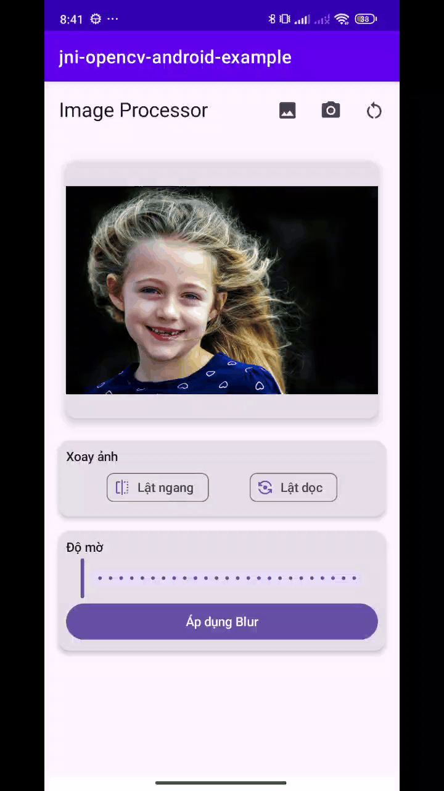

# Ứng Dụng Xử Lý Ảnh Android

Ứng dụng Android cho phép xử lý ảnh sử dụng thư viện OpenCV

    

## Tính Năng Nổi Bật ✨
- **Chụp ảnh & Chọn ảnh**  
  📸 Chụp ảnh trực tiếp qua CameraX  
  🖼️ Upload ảnh từ thư viện điện thoại

- **Biến Đổi Ảnh**  
  ↔️ Lật ảnh theo chiều ngang/dọc  
  🌫️ Làm mờ ảnh với thanh điều chỉnh độ mờ (0-25)  
  🔄 Reset ảnh về trạng thái gốc

- **Trải Nghiệm Người Dùng**  
  🎨 Giao diện Material Design 3  
  ⚡ Xem trước hiệu ứng thời gian thực  
  🔄 Kết hợp nhiều hiệu ứng liên tiếp (Flip + Blur + Flip)

## Công Nghệ Sử Dụng 🛠️

### Ngôn Ngữ & Nền Tảng
- **Kotlin**: Ngôn ngữ chính phát triển ứng dụng
- **Android SDK 34+**: Hỗ trợ các tính năng mới nhất
- **JNI (Java Native Interface)**: Kết nối code Kotlin với C++

### Thư Viện Chính
- **OpenCV 4.11.0**: Xử lý ảnh native (Flip/Blur)
- **CameraX**: Quản lý camera và chụp ảnh
- **Jetpack Compose**: Xây dựng UI hiện đại
- **Coroutines**: Xử lý bất đồng bộ

### Công Cụ Hỗ Trợ
- **Android Studio**: IDE phát triển
- **CMake**: Build native code
- **Material Design 3**: Hệ thống component UI